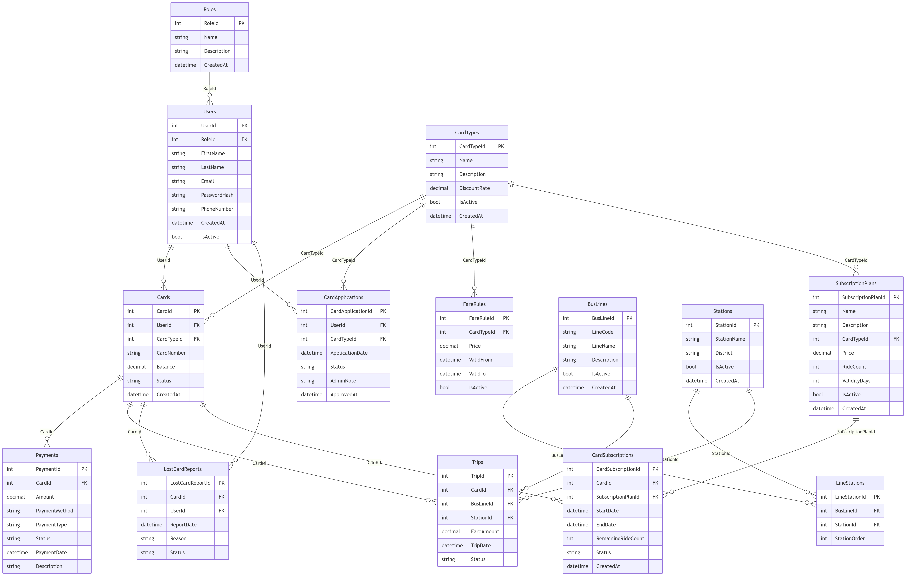
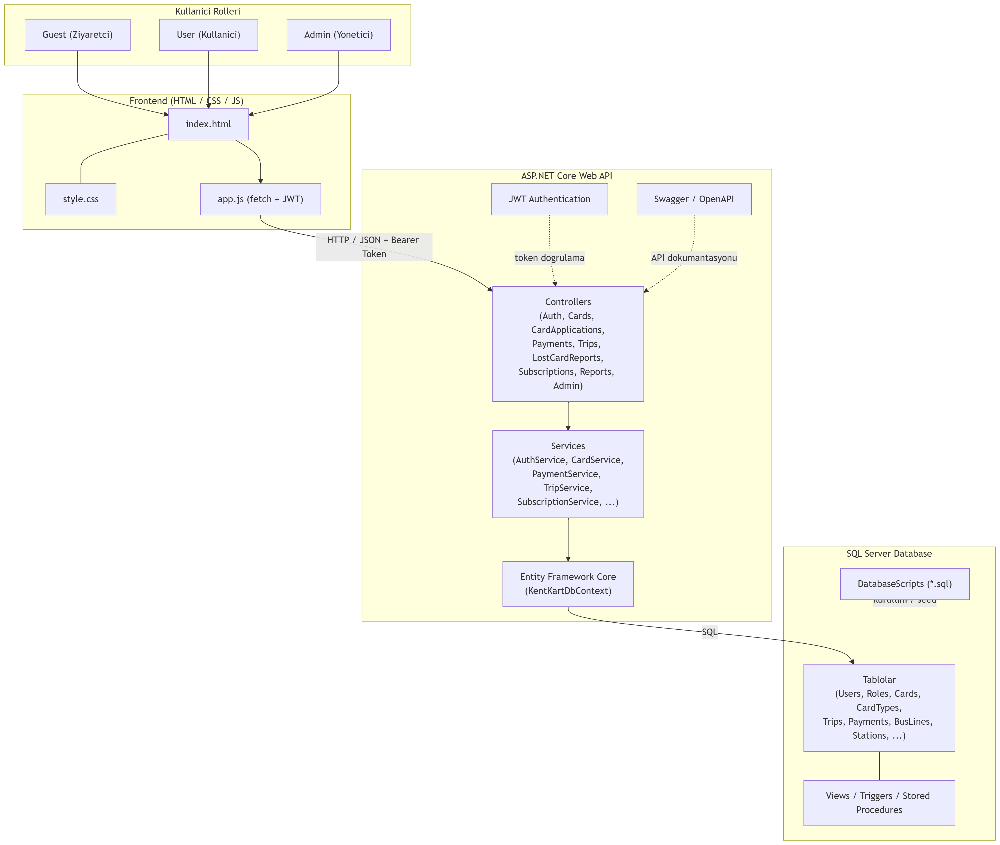
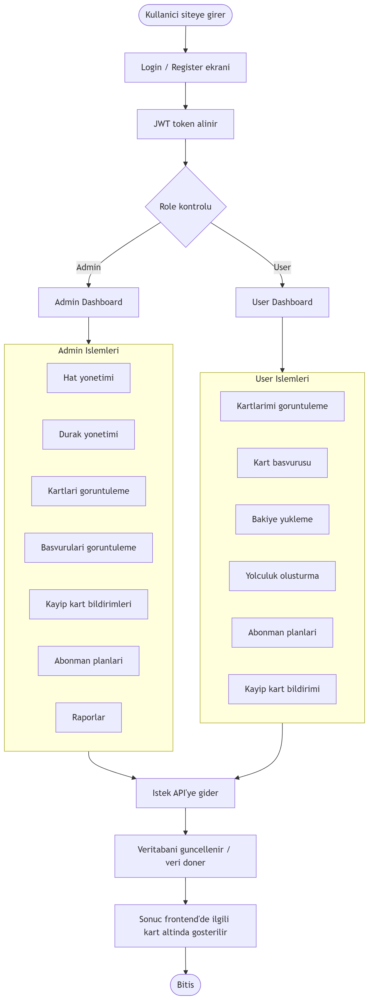
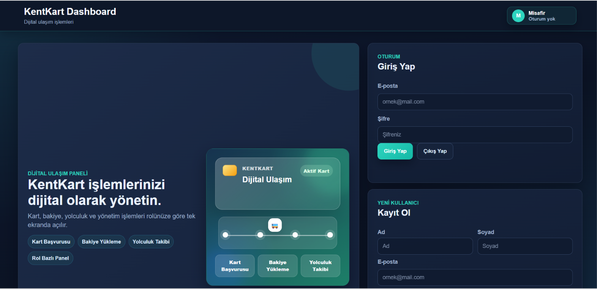
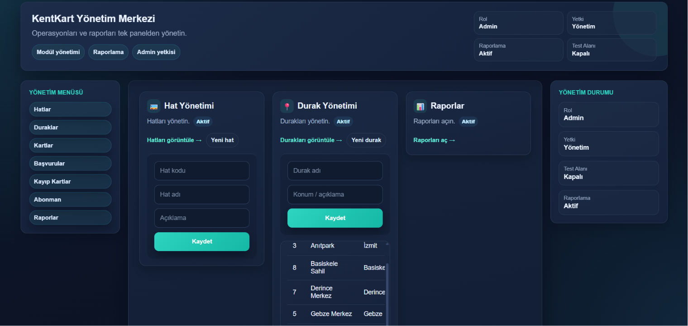
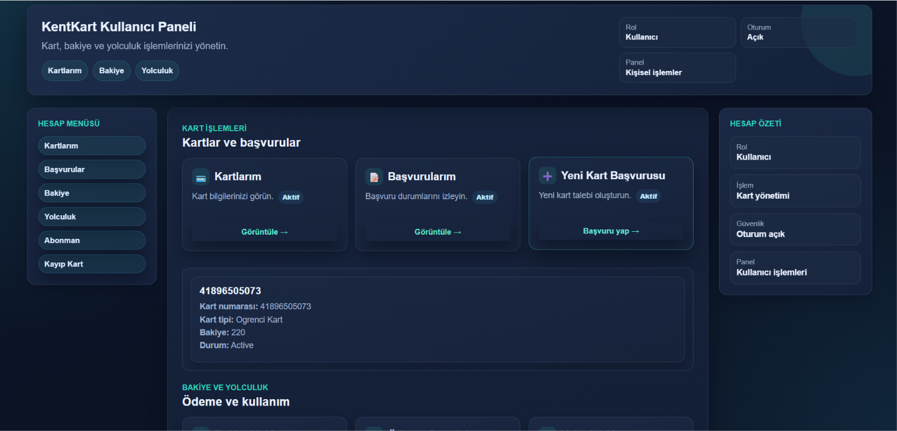
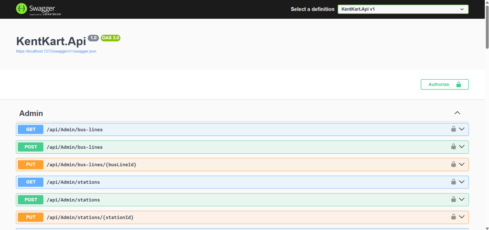

# KentKart Web App

Toplu taşıma kart başvurusu, kart yönetimi, bakiye yükleme, yolculuk, abonman, kayıp kart bildirimi ve admin yönetim işlemlerini içeren web tabanlı KentKart sistemi.

---

## 1. Proje Özeti

KentKart Web App, bir şehrin toplu taşıma kart sistemini sade bir şekilde modelleyen bir öğrenci projesidir. Amaç; kullanıcıların toplu taşıma kartlarını dijital ortamda yönetebilmesini ve yöneticilerin (admin) hat, durak, ücret ve başvuru gibi işlemleri tek bir panelden kontrol edebilmesini sağlamaktır.

Sistemde iki temel kullanıcı tipi vardır:

- **Kullanıcı (User):** Kendi kartlarını görüntüler, yeni kart başvurusu yapar, kartına bakiye yükler, yolculuk oluşturur, abonman planlarına bakar ve kayıp kart bildiriminde bulunur.
- **Yönetici (Admin):** Otobüs hatlarını ve durakları yönetir, sistemdeki tüm kartları ve başvuruları görüntüler, kayıp kart bildirimlerini inceler, abonman planlarını ve raporları takip eder.

Proje üç ana parçadan oluşur:

- **Frontend:** Saf HTML / CSS / JavaScript ile yazılmış, role göre değişen tek sayfalık arayüz.
- **Backend:** ASP.NET Core Web API ile yazılmış, JWT tabanlı kimlik doğrulama kullanan REST API.
- **Veritabanı:** SQL Server üzerinde Entity Framework Core ile yönetilen veritabanı; ayrıca view, trigger ve stored procedure içeren SQL scriptleri.

---

## 2. Kullanılan Teknolojiler

- **C#**
- **ASP.NET Core Web API**
- **Entity Framework Core**
- **SQL Server** (LocalDB ile geliştirme)
- **JWT Authentication**
- **Swagger** (API dokümantasyonu ve test)
- **HTML / CSS / JavaScript**
- **Git / GitHub**

---

## 3. Sistem Rolleri

### Misafir (Guest)
Giriş yapmamış ziyaretçidir. Yalnızca **Login / Register** ekranını görür. Diğer işlemlere erişebilmek için kayıt olup giriş yapması gerekir.

### Kullanıcı (User)
Giriş yaptıktan sonra kendi kullanıcı paneline ulaşır. Yapabildiği işlemler:
- Kartlarım (kendi kartlarını görüntüleme)
- Kart başvurusu
- Bakiye yükleme
- Yolculuk oluşturma
- Abonman planlarını görüntüleme ve satın alma
- Kayıp kart bildirimi

### Admin
Giriş yaptıktan sonra yönetim paneline ulaşır. Yapabildiği işlemler:
- Hat yönetimi (otobüs hatları)
- Durak yönetimi
- Kartları görüntüleme (sistemdeki tüm kartlar)
- Başvuruları görüntüleme ve onaylama / reddetme
- Kayıp kart bildirimlerini görüntüleme
- Abonman planları
- Raporlar
- Geliştirici (developer) test alanı

---

## 4. Proje Klasör Yapısı

```
KentKartWebApp/
├── KentKart.Api/        # ASP.NET Core Web API (backend)
├── Frontend/            # HTML / CSS / JS arayüz
├── DatabaseScripts/     # SQL view, trigger, stored procedure ve test scriptleri
├── docs/                # Diyagramlar ve ekran görüntüleri
└── README.md
```

- **KentKart.Api:** Controllers, Services, Entities, DTOs, Data (DbContext), Helpers ve Migrations klasörlerini içeren backend projesi.
- **Frontend:** `index.html`, `style.css`, `app.js` dosyalarından oluşan sade arayüz.
- **DatabaseScripts:** Veritabanı view, trigger, stored procedure, test sorguları ve örnek (dummy) verilerini içeren SQL dosyaları.
- **docs:** ER diyagramı, sistem mimarisi, akış diyagramı (`.mmd`) ve ekran görüntüleri.

---

## 5. Veritabanı Tasarımı

Aşağıdaki tablolar `KentKartDbContext` ve `Entities` klasöründeki sınıflara göre gerçek olarak projede tanımlıdır:

| Tablo | Açıklama |
|-------|----------|
| **Roles** | Kullanıcı rollerini (Admin, User) tutar. |
| **Users** | Sistemdeki kullanıcıların bilgilerini ve hangi role ait olduklarını tutar. |
| **CardTypes** | Kart tiplerini (Tam, Öğrenci, İndirimli) ve indirim oranlarını tutar. |
| **CardApplications** | Kullanıcıların yaptığı kart başvurularını ve başvuru durumunu (Pending/Approved/Rejected) tutar. |
| **Cards** | Kullanıcılara ait fiziksel/dijital kartları, kart numarasını ve bakiyesini tutar. |
| **Payments** | Kartlara yapılan bakiye yükleme ve abonman ödemelerini tutar. |
| **BusLines** | Otobüs hatlarını (hat kodu ve adı ile) tutar. |
| **Stations** | Durakları (durak adı ve ilçe bilgisi ile) tutar. |
| **LineStations** | Hatlar ile durakları sıra (StationOrder) bilgisiyle eşleştiren ara tablodur. |
| **FareRules** | Kart tipine göre geçerli yolculuk ücretlerini ve geçerlilik tarihlerini tutar. |
| **Trips** | Bir kartla yapılan yolculukları, hat/durak ve ücret bilgisiyle tutar. |
| **LostCardReports** | Kullanıcıların yaptığı kayıp kart bildirimlerini ve durumunu tutar. |
| **SubscriptionPlans** | Kart tipine bağlı abonman planlarını (fiyat, biniş sayısı, geçerlilik günü) tutar. |
| **CardSubscriptions** | Bir karta tanımlanmış aktif abonmanları ve kalan biniş hakkını tutar. |

> Not: Sistemde ayrı bir `Reports` tablosu **yoktur**. Raporlama, SQL view / stored procedure ve `ReportsController` üzerinden üretilir (bkz. Proje Notları).

---

## 6. Veritabanı İlişkileri

- **Role → User:** Bir rolün birden çok kullanıcısı olabilir; her kullanıcının bir rolü vardır.
- **User → Card:** Bir kullanıcının birden çok kartı olabilir.
- **User → CardApplication:** Bir kullanıcı birden çok kart başvurusu yapabilir.
- **Card → Payment:** Bir karta birden çok ödeme (bakiye yükleme / abonman) yapılabilir.
- **Card → Trip:** Bir kartla birden çok yolculuk yapılabilir.
- **Card → LostCardReport:** Bir kart için birden çok kayıp bildirimi olabilir.
- **BusLine ↔ Station (LineStations üzerinden):** Hatlar ve duraklar çoka-çok ilişkilidir; bu ilişki `LineStations` ara tablosu ve durak sırası (StationOrder) ile kurulur.
- **BusLine → Trip:** Bir hat üzerinde birden çok yolculuk gerçekleşebilir.
- **Station → Trip:** Bir durakta birden çok yolculuk başlayabilir/gerçekleşebilir.
- **Card → CardSubscription:** Bir karta birden çok abonman tanımlanabilir.
- **SubscriptionPlan → CardSubscription:** Bir abonman planı birden çok kart aboneliğinde kullanılabilir.
- **CardType → Card / CardApplication / FareRule / SubscriptionPlan:** Kart tipi; kartlar, başvurular, ücret kuralları ve abonman planları ile ilişkilidir.

---

## 7. ER Diyagramı



---

## 8. Sistem Mimarisi

Sistem katmanlı bir yapıda çalışır:

```
Frontend (HTML/CSS/JS)
        │  HTTP + JSON (JWT Bearer Token)
        ▼
ASP.NET Core Web API
   ├── Controllers   → gelen istekleri karşılar
   ├── Services      → iş kurallarını çalıştırır
   └── EF Core (DbContext) → veritabanı erişimi
        │
        ▼
   SQL Server Database
```

İstek akışı: **Frontend → API → Controllers → Services → EF Core → SQL Server**. Veritabanından dönen sonuç aynı yol üzerinden geri dönerek frontend'de gösterilir. (Projede ayrı bir Repository katmanı kullanılmamış, veri erişimi servis sınıfları içinden doğrudan EF Core DbContext ile yapılmıştır.)



---

## 9. Uygulama Akış Diyagramı

Uygulama **role göre (role-based)** çalışır:

1. Kullanıcı siteye girer.
2. Login / Register ekranı görüntülenir.
3. Giriş başarılı olursa JWT token alınır.
4. Token içindeki role kontrol edilir.
5. **Admin** ise Admin Dashboard, **User** ise User Dashboard açılır.
6. Seçilen işlem API'ye gider, veritabanı güncellenir veya veri döner.
7. Sonuç frontend'de ilgili kart (panel) altında gösterilir.



---

## 10. SQL Scriptleri

`DatabaseScripts/` klasörü, veritabanı tarafında çalışan ek nesneleri ve test verilerini içerir:

| Dosya | Açıklama |
|-------|----------|
| **01_Views.sql** | Veritabanı **view**'larını oluşturur. View, bir veya birden çok tabloyu birleştirip hazır bir "sanal tablo" gibi sunan sorgudur; örneğin raporlama için kullanılır. |
| **02_Triggers.sql** | **Trigger**'ları oluşturur. Trigger, bir tabloda ekleme/güncelleme gibi bir işlem olduğunda otomatik çalışan koddur (örn. bir ödeme eklenince kart bakiyesinin güncellenmesi). |
| **03_StoredProcedures.sql** | **Stored procedure**'leri oluşturur. Stored procedure, veritabanı içinde saklanan ve çağrıldığında çalışan hazır SQL işlem bloğudur. |
| **04_TestQueries.sql** | **Test sorgularıdır.** Verilerin doğru gelip gelmediğini kontrol etmek için elle çalıştırılabilecek örnek SELECT sorgularını içerir. |
| **05_DummyData.sql** | **Dummy (örnek) veri** ekler. Sistemi denemek için örnek kullanıcı, kart, yolculuk gibi sahte verileri veritabanına yükler. |

**Kavramlar kısaca:**
- **View:** Hazır, tekrar tekrar kullanılan sorgu görünümü.
- **Trigger:** Belirli bir tablo işleminde otomatik tetiklenen kod.
- **Stored Procedure:** Veritabanında saklanan, çağrılınca çalışan işlem.
- **Test Queries:** Sonuçları doğrulamak için yazılan deneme sorguları.
- **Dummy Data:** Test amaçlı eklenen örnek veriler.

---

## 11. Backend API Özeti

| Controller | Görevi |
|------------|--------|
| **AuthController** | Kayıt (`register`) ve giriş (`login`) işlemlerini yapar; başarılı girişte JWT token döner. |
| **AdminController** | Otobüs hatları, duraklar ve ücret kurallarının (fare rules) listelenmesi, eklenmesi ve güncellenmesi işlemlerini yönetir. |
| **CardsController** | Kullanıcının kendi kartlarını görüntülemesini, ayrıca admin için tüm kartların listelenmesini sağlar. |
| **CardApplicationsController** | Kart başvurusu oluşturma, kullanıcının kendi başvurularını görme ve admin tarafından başvuruları onaylama/reddetme işlemlerini yapar. |
| **PaymentsController** | Karta bakiye yükleme ve kullanıcının kendi ödeme geçmişini görüntüleme işlemlerini yapar. |
| **TripsController** | Yeni yolculuk oluşturma ve kullanıcının kendi yolculuklarını listeleme işlemlerini yapar. |
| **LostCardReportsController** | Kayıp kart bildirimi oluşturma, kullanıcının kendi bildirimlerini ve admin için tüm bildirimleri görüntüleme işlemlerini yapar. |
| **SubscriptionsController** | Abonman planlarını listeleme, abonman satın alma ve kullanıcının kendi aboneliklerini görüntüleme işlemlerini yapar. |
| **ReportsController** | Kullanıcı paneli özeti, günlük gelir ve en çok kullanılan hatlar gibi raporları üretir (SQL view / stored procedure tabanlı). |

---

## 12. Frontend Özellikleri

- **Saf HTML / CSS / JavaScript** ile yazılmıştır; herhangi bir frontend framework kullanılmamıştır.
- **Role-based UI:** Arayüz, giriş yapan kullanıcının rolüne göre değişir.
- **Guest / Admin / User ayrımı:** Misafir yalnızca giriş/kayıt görür; admin ve kullanıcı farklı paneller görür.
- **Dark premium dashboard tasarımı:** Koyu temalı, modern bir gösterge paneli görünümü.
- **Profil dropdown:** Kullanıcı bilgileri ve çıkış için açılır profil menüsü.
- **Tema değiştirme:** Açık/koyu tema geçişi.
- **Kart bazlı local result alanları:** Her işlem kartının altında o işleme ait sonuç ayrı gösterilir.
- **Toggle / collapse sonuç davranışı:** Sonuç alanları açılıp kapanabilir.
- **Developer (geliştirici) test alanı:** Yalnızca admin ekranında görünür.

---

## 13. Ekran Görüntüleri

**Misafir Ekranı**



**Admin Dashboard**



**Kullanıcı Dashboard**



**Swagger**



---

## 14. Kurulum ve Çalıştırma

1. **Repoyu klonlayın:**
   ```bash
   git clone https://github.com/eyupcanpolat/KentKartWebApp
   cd KentKartWebApp
   ```

2. **SQL Server connection string'i kontrol edin:**
   `KentKart.Api/appsettings.json` içindeki `DefaultConnection` ayarını kendi SQL Server / LocalDB yapınıza göre düzenleyin. Varsayılan ayar:
   ```
   Server=(localdb)\MSSQLLocalDB;Database=KentKartDb;Trusted_Connection=True;TrustServerCertificate=True;
   ```

3. **Projeyi Visual Studio ile açın:**
   `KentKart.Api.sln` dosyasını Visual Studio ile açın.

4. **Veritabanını oluşturun:**
   - EF Core migration ile:
     ```bash
     dotnet ef database update
     ```
     (veya Visual Studio'da Package Manager Console > `Update-Database`)
   - Ardından `DatabaseScripts/` içindeki scriptleri sırayla çalıştırarak view, trigger, stored procedure ve örnek verileri ekleyin:
     `01_Views.sql → 02_Triggers.sql → 03_StoredProcedures.sql → 05_DummyData.sql` (test için `04_TestQueries.sql`).

5. **API'yi çalıştırın:**
   Visual Studio'dan veya terminalden:
   ```bash
   dotnet run --project KentKart.Api
   ```

6. **Swagger'ı açın:**
   API çalışınca tarayıcıda Swagger arayüzüne gidin:
   ```
   https://localhost:<port>/swagger
   ```

7. **Frontend'i çalıştırın:**
   `Frontend/index.html` dosyasını **Live Server** (VS Code eklentisi) ile açın.

8. **CORS / port bilgisi:**
   Backend, frontend için yalnızca **5500** portuna izin verir (`http://127.0.0.1:5500` ve `http://localhost:5500`). Bu yüzden frontend'i Live Server ile **5500** portundan çalıştırmanız gerekir.

---

## 15. Test Senaryoları

- Kayıt olma (Register) ve giriş yapma (Login)
- Admin: hat listeleme ve yeni hat ekleme
- Admin: durak listeleme ve yeni durak ekleme
- Kullanıcı: kendi kartlarını görüntüleme
- Kullanıcı: kart başvurusu yapma
- Kullanıcı: kartına bakiye yükleme
- Kullanıcı: yolculuk oluşturma
- Abonman planlarını görüntüleme
- Kayıp kart bildirimi oluşturma
- Rapor görüntüleme (kullanıcı paneli özeti / günlük gelir / en çok kullanılan hatlar)

---

## 16. Proje Notları

- Raporlama için ayrı bir `Reports` tablosu kullanılmamıştır. Raporlar; SQL **view / stored procedure** ve **ReportsController** üzerinden üretilir.
- **Geliştirici (developer) test alanı** yalnızca admin ekranında yer alır.
- Frontend, herhangi bir framework kullanılmadan sade **HTML / CSS / JavaScript** ile yapılmıştır.

---

## 17. GitHub

GitHub Linki: https://github.com/eyupcanpolat/KentKartWebApp
